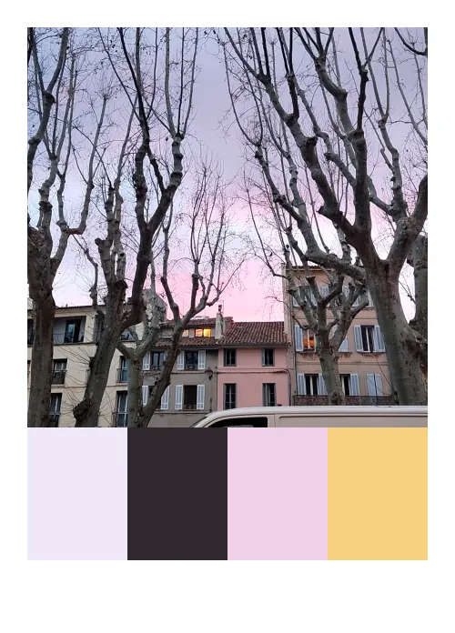

Environ un mois que je bricole une app jouet pour extraire des palettes de couleur du monde réel.

L'idée m'est venue lors d'un cours d'initiation au développement web, animé pour l'école LDLC et la proposition aux étudiants de concevoir un **micro-tool**.

## Micro-tool : courte définition personnelle

> Un **petit** logiciel ou bout de code fabriqué en réponse à une envie ou un besoin **précis**.

Dans leur simplicité, les micro-outils sont d'une grande efficacité à l'inverse de logiciels multi-fonctions, complexes, lourds et qui demandent des abonnements ou des licences onéreuses.

## Sélection de micro-tools

- [https://delphi.tools/](https://delphi.tools/)
- [https://framadate.org/](https://framadate.org/abc/en/)
- [https://antinote.io/](https://antinote.io/)
- [https://mklaabs.com/](https://mklaabs.com/)
- [https://whtifs.com/](https://whtifs.com/)
- [https://spacetypegenerator.com/](https://spacetypegenerator.com/)
- [https://upscayl.org/](https://upscayl.org/)

## Et l'IA dans tout ça ?

Le _vibe-coding_, pour le meilleur ou pour le pire, démocratise ce type de développement. Il donne des moyens de création à un public plus large de non-développeurs, à l'instar de la vague "no-code" et, si l'on remonte davantage dans le temps, on pourrait ajouter Flash et le mythique logiciel HyperCard, créé par [Bill Atkinson](https://en.wikipedia.org/wiki/Bill_Atkinson) pour Apple.

Dans cette direction, on voit émerger des produits spécialisés en _vibe-coding_, comme [Glaze](https://www.glazeapp.com/) ou [Essential App](https://playground.nothing.tech/apps) de l'entreprise hardware Nothing, et pour les plus connus : [Lovable](https://lovable.dev/), [V0](https://v0.app/), [Base44](https://base44.com/), [Floot](https://floot.com/) etc…

## Et nous ?

Pour [colorcatchers.co](http://colorcatchers.co), on utilise Claude Code pour nous assister dans le développement ; nous avons un petit workflow avec des _skills_ et des MCP. Sans IA pour nous assister dans le dev, nous n'aurions peut-être pas osé investir autant d'énergie dans une idée aussi "bête" ;).
